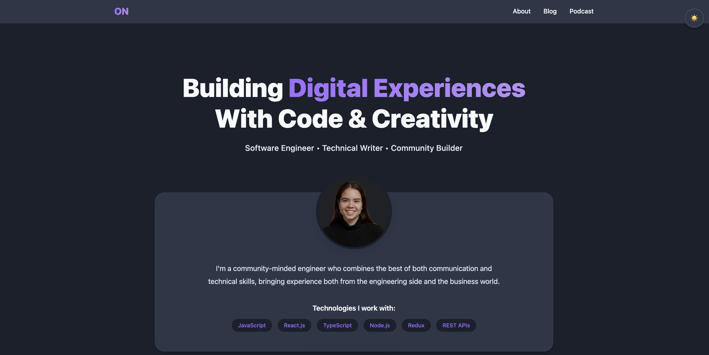

<div align="center">
  <h1> My Software Engineering Portfolio 🚀</h1>
  <p>A modern, responsive portfolio showcasing my software engineering journey and technical blog posts.</p>
  
  <a href="https://olganedelcu.com">View Live Demo</a> · 
  <a href="https://github.com/olganedelcu/olga-software-engineer/issues">Report Bug</a> ·
  <a href="https://github.com/olganedelcu/olga-software-engineer/issues">Request Feature</a>
</div>

<div align="center">
  
</div>

---

## ✨ Features

- 🎨 **Modern Design** - Clean, responsive interface built with React and TypeScript
- 📱 **Mobile First** - Fully responsive across all devices
- 📝 **Dynamic Blog** - Integrated with Hashnode API to showcase latest articles
- 🌓 **Theme Toggle** - Switch between light and dark modes
- 🚀 **Performance** - Built with Vite for optimal loading speeds
- 📊 **Analytics Ready** - Set up to track user interactions

## 🛠️ Tech Stack

- **Framework:** React
- **Language:** TypeScript
- **Build Tool:** Vite
- **Styling:** Tailwind CSS
- **API:** GraphQL (Hashnode)
- **Deployment:** Vercel

## 🚀 Quick Start

1. **Clone the repository:**

    ```bash
    git clone https://github.com/olganedelcu/olga-software-engineer.git
    ```

2. **Install dependencies:**

    ```bash
    cd olga-software-engineer
    npm install
    ```

3. **Start development server:**

    ```bash
    npm run dev
    ```

4. **Build for production:**

    ```bash
    npm run build
    ```

## 📝 Environment Variables

Create a `.env` file in the root directory:

```env
VITE_HASHNODE_TOKEN=your_token_here
VITE_GA_TRACKING_ID=your_ga_id_here

```
## 📚 API Integration

### Hashnode Blog Posts

```query {
  user(username: "YOUR_USERNAME") {
    publication {
      posts(page: 1) {
        title
        brief
        slug
        dateAdded
        coverImage
      }
    }
  }
}
```


## 📁 Project Structure

src/

├── components/   # Reusable UI components
│   ├── Header/
│   ├── Footer/
│   ├── Blog/
│   └── Projects/
├── pages/        # Main page components
│   ├── Home/
│   ├── About/
│   └── Contact/
├── api/          # API integration logic
├── hooks/        # Custom React hooks
├── types/        # TypeScript types
├── utils/        # Utility functions
└── styles/       # Global styles


## 🎯 Key Features Explained

### Blog Integration
The blog section automatically fetches and displays my latest articles from Hashnode using their GraphQL API. This keeps my portfolio up-to-date with my latest technical writing without manual updates.

### Responsive Design
The portfolio is built with a mobile-first approach, ensuring a seamless experience across all devices:
- 📱 Mobile: < 640px
- 💻 Tablet: 640px - 1024px
- 🖥️ Desktop: > 1024px

### Theme Switching
Users can toggle between light and dark modes, with the selection persisted in local storage for future visits.

## 🤝 Contributing

1. Fork the Project
2. Create your Feature Branch (`git checkout -b feature/AmazingFeature`)
3. Commit your Changes (`git commit -m 'Add some AmazingFeature'`)
4. Push to the Branch (`git push origin feature/AmazingFeature`)
5. Open a Pull Request

## 🐛 Known Issues

See the [open issues](https://github.com/olganedelcu/olga-software-engineer/issues) for a list of known issues and proposed features.

## 📜 License

Distributed under the MIT License. See `LICENSE` for more information.

## 👋 Contact

Olga Nedelcu
- LinkedIn: [Olga Nedelcu](https://linkedin.com/in/olganedelcu)
- Blog: [Hashnode](https://olgaconstantina.hashnode.dev/)

Project Link: [https://github.com/olganedelcu/olga-software-engineer](https://github.com/olganedelcu/olga-software-engineer)

---

<div align="center">
  Made with ❤️ by <a href="https://github.com/olganedelcu">Olga Nedelcu</a>
</div>
